# ⚡ Real-time RNA-seq Pipeline

```mermaid
%%{init: {'theme':'dark', 'themeVariables': { 'primaryColor':'#1e3a8a','primaryTextColor':'#fff','primaryBorderColor':'#3b82f6','lineColor':'#60a5fa','secondaryColor':'#7c3aed','tertiaryColor':'#059669','noteBkgColor':'#1f2937','noteTextColor':'#fff'}}}%%
flowchart TB

    subgraph INPUT[📥 Sequencing Input Layer]
        A1["FASTQ (Nanopore/Illumina)"]:::inputNode
        A2[Live Streaming Data]:::inputNode
    end

    subgraph WATCHER[👀 Real-time Monitoring Layer]
        B1["File Watcher\n(inotify / fswatch / cron)"]:::watchNode
    end

    subgraph ORCH[⚡ Nextflow Orchestration Layer]
        C1[Channel Creation]:::orchNode
        C2[Process Triggers]:::orchNode
        C3[Parallel Execution Engine]:::orchNode
    end

    subgraph MODULES[🔬 Analysis Modules]
        D1[🧬 Dorado Basecalling]:::moduleNode
        D2[🛰 Minimap2 Alignment]:::moduleNode
        D3[🔢 FeatureCounts Quantification]:::moduleNode
        D4[🔥 JAFFAL Fusion Detection]:::moduleNode
    end

    subgraph OUTPUT[📤 Output Layer]
        E1["(Gene Counts)"]:::outputNode
        E2["(Fusion Events)"]:::outputNode
    end

    subgraph CLOUD[☁️ Cloud/HPC Execution]
        F1[AWS Batch]:::cloudNode
        F2[Google Cloud Batch]:::cloudNode
        F3[SLURM HPC]:::cloudNode
        F4[Docker/Singularity]:::cloudNode
    end

    A1 --> B1
    A2 --> B1

    B1 --> C1
    C1 --> C2
    C2 --> C3

    C3 --> D1
    C3 --> D2
    C3 --> D3
    C3 --> D4

    D3 --> E1
    D4 --> E2

    ORCH -. runs on .-> CLOUD

    classDef inputNode fill:#3b82f6,stroke:#1e40af,stroke-width:3px,color:#fff
    classDef watchNode fill:#8b5cf6,stroke:#6d28d9,stroke-width:3px,color:#fff
    classDef orchNode fill:#f59e0b,stroke:#d97706,stroke-width:3px,color:#fff
    classDef moduleNode fill:#10b981,stroke:#059669,stroke-width:3px,color:#fff
    classDef outputNode fill:#ec4899,stroke:#db2777,stroke-width:3px,color:#fff
    classDef cloudNode fill:#06b6d4,stroke:#0891b2,stroke-width:3px,color:#fff
    
    style INPUT fill:#1e3a8a,stroke:#3b82f6,stroke-width:2px,color:#fff
    style WATCHER fill:#581c87,stroke:#7c3aed,stroke-width:2px,color:#fff
    style ORCH fill:#92400e,stroke:#f59e0b,stroke-width:2px,color:#fff
    style MODULES fill:#065f46,stroke:#10b981,stroke-width:2px,color:#fff
    style OUTPUT fill:#9f1239,stroke:#ec4899,stroke-width:2px,color:#fff
    style CLOUD fill:#155e75,stroke:#06b6d4,stroke-width:2px,color:#fff
```



<p align="center">
  <!-- CI/CD & Testing Badges -->
  <a href="https://github.com/mtariqi/rna-seq-realtime-pipeline/actions/workflows/test.yml">
    
  </a>
  
  
</p>

<p align="center">
  <!-- Core Technology Badges - Large -->
  
  
  
  
  
</p>

<p align="center">
  <!-- Platform & Execution Badges -->
  
  
  
  
  
</p>

<p align="center">
  <!-- Analysis Tools & Features -->
  
  
  
  
  
</p>

<p align="center">
  <!-- Data & Processing Badges -->
  
  
  
  
  
</p>

<p align="center">
  <!-- Version, License, DOI -->
  
  
  <a href="https://doi.org/10.5281/zenodo.17603512">
    
  </a>
  
  
</p>

<p align="center">
  <!-- Application Area Badges -->
  
  
  
</p>

---

A modular **Nextflow DSL2** workflow for *streaming-aware* RNA-seq processing using **Dorado, Minimap2, FeatureCounts, and JAFFAL fusion detection**.

## 👤 Author

**MD Tariqul Islam (Tariq)**  
**GitHub:** [@mtariqi](https://github.com/mtariqi)  
**LinkedIn:** https://www.linkedin.com/in/mdtariqulscired  
**License:** MIT  
**Version:** 1.0.0  
**Last Updated:** November 2025  

---

## 🔍 Overview

This project provides a **real-time, event-driven RNA-seq pipeline** for cloud & HPC environments.  
It automatically watches a directory for new FASTQ files and triggers downstream RNA-seq processing:

- ⚙️ **Basecalling** – via ONT *Dorado*  
- 🛰️ **Alignment** – *Minimap2*  
- 🔢 **Quantification** – *FeatureCounts*  
- 🔥 **Fusion detection** – *JAFFAL*  
- 🧪 **Streaming mode** – continuous monitoring for new sequencing data  

Ideal for **Nanopore live basecalling**, **Illumina streaming**, **clinical diagnostics**, and **real-time genomics**.

---

## 🔑 Key Features

| Category | Description |
|-----------|--------------|
| 🧬 **Dorado Basecalling** | GPU-optimized Oxford Nanopore basecaller |
| 🧭 **Streaming Alignment** | On-the-fly spliced alignment using [`minimap2`](https://github.com/lh3/minimap2) |
| 📊 **Incremental Quantification** | Gene-level counting via [`featureCounts`](https://subread.sourceforge.net) |
| 🔍 **Fusion Detection** | Continuous fusion transcript detection using [`JAFFAL`](https://github.com/Oshlack/JAFFAL) |
| 🧠 **Automation** | Real-time file watcher triggers the pipeline automatically as FASTQ files appear |
| ⚙️ **Nextflow DSL2 Modularity** | Scalable, maintainable processes and channels |
| 🧪 **CI Integration** | Automated GitHub Actions test with environment validation and dry-run simulation |
| 🔐 **Reproducibility** | Environment-locked `environment.yml` for fully deterministic runs |

---

## 🧩 Project Structure

```
rna-seq-realtime-pipeline/
├── .github/workflows/     # CI automation (Nextflow validation + dry-run)
├── data/                  # Example FASTQ input data
├── results/               # Pipeline output
├── scripts/               # Helper scripts & utilities
├── watcher/               # File watcher for real-time streaming mode
├── nextflow.config        # Runtime configuration
├── main.nf                # Core Nextflow workflow (DSL2)
├── environment.yml        # Conda environment definition
└── README.md              # Project documentation
```

---

## ⚙️ Installation

### 1️⃣ Clone the repository

```bash
git clone https://github.com/mtariqi/rna-seq-realtime-pipeline.git
cd rna-seq-realtime-pipeline
```

### 2️⃣ Create Conda environment

```bash
conda env create -f environment.yml
conda activate rna_realtime_env
```

### 3️⃣ Run a quick test (dry-run)

```bash
nextflow run main.nf -stub-run
```

### 4️⃣ Enable real-time watcher

```bash
bash watcher/watch_and_process.sh
```

This continuously monitors your FASTQ directory and launches analysis as new data arrive.

---

## 🧪 Continuous Integration (CI)

The repository includes an automated workflow using GitHub Actions to:

- Build and validate the `rna_realtime_env` Conda environment
- Install and verify Nextflow, FastQC, MultiQC, and Minimap2
- Perform a Nextflow dry-run simulation (`-stub-run`)
- Upload diagnostic logs as CI artifacts

You can view the live CI status under the **Actions** tab or by checking the badge above.

---

## 📈 Example Output

| Module | Output | Description |
|--------|--------|-------------|
| FastQC | `results/fastqc/` | Quality metrics per read |
| Minimap2 | `results/alignment/` | Spliced alignments (BAM/SAM) |
| FeatureCounts | `results/counts.txt` | Gene-level counts |
| JAFFAL | `results/fusions/` | Fusion gene candidates |
| MultiQC | `results/multiqc_report.html` | Aggregated QC report |

---

## 🧮 Reproducibility

- **Workflow Language:** Nextflow DSL2
- **Environment Manager:** Conda
- **Container Support:** Docker / Singularity (optional)
- **Validation:** Continuous Integration via GitHub Actions

For full reproducibility, freeze all package versions before deployment:

```bash
conda env export > environment.lock.yml
```

---

## 📚 Citation

If you use this pipeline in your research, please cite:

### APA Format

> Islam, M. T. (2025). *Real-time RNA-seq Pipeline (v1.0.0)* [Computer software]. Zenodo. https://doi.org/10.5281/zenodo.17603512

### BibTeX

```bibtex
@software{islam_2025_rnaseq,
  author       = {Islam, MD Tariqul},
  title        = {Real-time RNA-seq Pipeline},
  version      = {1.0.0},
  year         = {2025},
  month        = {11},
  publisher    = {Zenodo},
  doi          = {10.5281/zenodo.17603512},
  url          = {https://doi.org/10.5281/zenodo.17603512}
}
```

---

## 🧠 References

- Islam, M. T. (2025). *Real-time RNA-seq Pipeline (v1.0.0)* [Software]. Zenodo. https://doi.org/10.5281/zenodo.17603512
- Li H. (2018). Minimap2: pairwise alignment for nucleotide sequences. *Bioinformatics*, 34(18): 3094–3100.
- Davidson N. et al. (2022). JAFFAL: Fusion gene detection from long-read transcriptome data. *Bioinformatics*, 38(6): 1577–1583.
- Oxford Nanopore Technologies (2024). Dorado Basecaller.
- Subread Team (2014). featureCounts: efficient read summarization program.

---

## 🤝 Contributing

Contributions and pull requests are welcome! Please fork the repo, create a feature branch, and submit a pull request.

```bash
git checkout -b feature/new-module
git commit -m "Add new module"
git push origin feature/new-module
```

---

## 📧 Contact

For technical inquiries or collaborations:

- 📩 Email: tariqul@scired.com
- 🌐 LinkedIn: [www.linkedin.com/in/mdtariqulscired](https://www.linkedin.com/in/mdtariqulscired)
- 💻 GitHub: [https://github.com/mtariqi](https://github.com/mtariqi)

---

## 🧾 License

This project is released under the [MIT License](LICENSE).

---

> *"Real-time RNA-seq analysis is not just computation — it's precision medicine in motion."*  
> — MD Tariqul Islam (Tariq)
